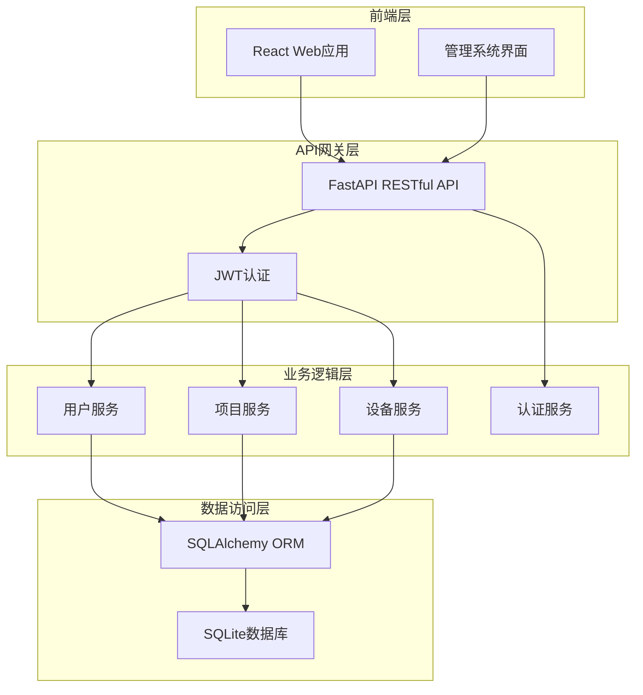

# 安防管理系统架构文档

## 技术栈
- **后端**: FastAPI + SQLAlchemy + Pydantic
- **前端**: React + Ant Design
- **数据库**: SQLite (开发) / MySQL (生产)
- **认证**: JWT Token
- **部署**: 单机部署

## 系统架构

## 核心模块

### 1. 用户管理模块
- 用户角色：超级用户、项目管理员、普通用户
- JWT token认证
- 基于角色的权限控制

### 2. 项目管理模块
- 项目创建、编辑、删除
- 项目数据隔离
- 项目管理员指派

### 3. 设备管理模块
- 摄像头设备信息管理
- 设备状态监控
- 设备权限分配

### 4. 认证授权模块
- JWT token生成与验证
- 权限装饰器
- 路由保护

## 数据库设计

### 用户表 (users)
| 字段 | 类型 | 说明 |
|------|------|------|
| id | Integer PK | 用户ID |
| username | String(50) | 用户名 |
| password_hash | String(255) | 密码哈希 |
| email | String(100) | 邮箱 |
| role | String(20) | 角色 |
| created_at | DateTime | 创建时间 |

### 项目表 (projects)
| 字段 | 类型 | 说明 |
|------|------|------|
| id | Integer PK | 项目ID |
| name | String(100) | 项目名称 |
| description | Text | 项目描述 |
| created_by | Integer FK | 创建者 |
| created_at | DateTime | 创建时间 |

### 设备表 (devices)
| 字段 | 类型 | 说明 |
|------|------|------|
| id | Integer PK | 设备ID |
| index_code | String(100) | 设备标识码 |
| name | String(100) | 设备名称 |
| ip_address | String(45) | IP地址 |
| status | String(20) | 状态 |
| project_id | Integer FK | 所属项目 |
| created_at | DateTime | 创建时间 |

## API设计原则
1. RESTful风格接口
2. 版本控制 (v1/)
3. JWT token认证
4. 统一的响应格式
5. 详细的错误处理

## 安全考虑
- JWT token过期时间控制
- 密码加密存储
- SQL注入防护
- XSS攻击防护
- CSRF保护