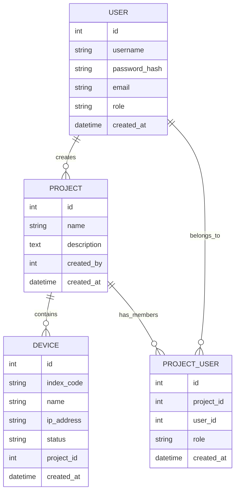

# 数据库设计文档

## 数据库选择
- **开发环境**: SQLite
- **生产环境**: MySQL/PostgreSQL
- **ORM**: SQLAlchemy

## 数据表结构

### 用户表 (users)
```sql
CREATE TABLE users (
    id INTEGER PRIMARY KEY AUTOINCREMENT,
    username VARCHAR(50) UNIQUE NOT NULL,
    password_hash VARCHAR(255) NOT NULL,
    email VARCHAR(100) UNIQUE NOT NULL,
    role VARCHAR(20) NOT NULL DEFAULT 'user',
    created_at DATETIME DEFAULT CURRENT_TIMESTAMP,
    
    CHECK (role IN ('superuser', 'admin', 'user'))
);

-- 索引
CREATE INDEX idx_users_username ON users(username);
CREATE INDEX idx_users_email ON users(email);
CREATE INDEX idx_users_role ON users(role);
```

### 项目表 (projects)
```sql
CREATE TABLE projects (
    id INTEGER PRIMARY KEY AUTOINCREMENT,
    name VARCHAR(100) NOT NULL,
    description TEXT,
    created_by INTEGER NOT NULL,
    created_at DATETIME DEFAULT CURRENT_TIMESTAMP,
    
    FOREIGN KEY (created_by) REFERENCES users(id) ON DELETE CASCADE
);

-- 索引
CREATE INDEX idx_projects_created_by ON projects(created_by);
CREATE INDEX idx_projects_name ON projects(name);
```

### 设备表 (devices)
```sql
CREATE TABLE devices (
    id INTEGER PRIMARY KEY AUTOINCREMENT,
    index_code VARCHAR(100) NOT NULL,
    name VARCHAR(100) NOT NULL,
    ip_address VARCHAR(45),
    stream_url TEXT,
    status VARCHAR(20) DEFAULT 'online',
    project_id INTEGER NOT NULL,
    created_at DATETIME DEFAULT CURRENT_TIMESTAMP,
    
    FOREIGN KEY (project_id) REFERENCES projects(id) ON DELETE CASCADE,
    CHECK (status IN ('online', 'offline', 'maintenance'))
);

-- 索引
CREATE INDEX idx_devices_project_id ON devices(project_id);
CREATE INDEX idx_devices_index_code ON devices(index_code);
CREATE INDEX idx_devices_status ON devices(status);
CREATE UNIQUE INDEX idx_devices_unique_index ON devices(index_code, project_id);
```

### 项目用户关联表 (project_users)
```sql
CREATE TABLE project_users (
    id INTEGER PRIMARY KEY AUTOINCREMENT,
    project_id INTEGER NOT NULL,
    user_id INTEGER NOT NULL,
    role VARCHAR(20) DEFAULT 'member',
    created_at DATETIME DEFAULT CURRENT_TIMESTAMP,
    
    FOREIGN KEY (project_id) REFERENCES projects(id) ON DELETE CASCADE,
    FOREIGN KEY (user_id) REFERENCES users(id) ON DELETE CASCADE,
    UNIQUE (project_id, user_id),
    CHECK (role IN ('admin', 'member'))
);

-- 索引
CREATE INDEX idx_project_users_project ON project_users(project_id);
CREATE INDEX idx_project_users_user ON project_users(user_id);
```

## 初始数据

### 默认超级用户
```sql
INSERT INTO users (username, password_hash, email, role)
VALUES ('admin', '$2b$12$EixZaYVK1fsbw1ZfbX3OXePaWxn96p36WQoeG6Lruj3vjPGga31lW', 'admin@example.com', 'superuser');
```

### 示例项目
```sql
INSERT INTO projects (name, description, created_by)
VALUES ('默认项目', '系统默认项目', 1);
```

## 数据关系图



## 数据验证规则

### 用户数据验证
- 用户名: 3-50字符，字母数字下划线
- 邮箱: 有效的邮箱格式
- 密码: 最小8字符，包含字母和数字
- 角色: 只能是'superuser', 'admin', 'user'

### 项目数据验证
- 项目名称: 2-100字符
- 描述: 可选，最大1000字符

### 设备数据验证
- 设备标识码: 唯一，非空
- IP地址: 有效的IP格式
- 状态: 只能是'online', 'offline', 'maintenance'

## 性能优化建议
1. 为常用查询字段创建索引
2. 定期清理过期数据
3. 使用连接池管理数据库连接
4. 生产环境使用更强大的数据库（MySQL/PostgreSQL）